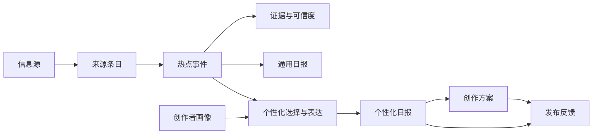

# 微蓝日报 PRD

| 属性 | 内容 |
|---|---|
| 文档版本 | v1.0 |
| 状态 | 已确认，进入 MVP 实施 |
| 日期 | 2026-08-19 |
| 产品阶段 | 一周邀请制 MVP |
| 目标平台 | Web + Email |
| 首个内容场景 | AI 信息 → 抖音选题 |
| 配套文档 | [领域术语表](./CONTEXT.md) · [核心架构决策](./docs/adr/0001-shared-hot-event-pool-personalized-recommendations.md) |

## 1. 产品摘要

### 1.1 一句话定位

每天把海外最新 AI 动态，转化成三个适合创作者账号的抖音选题。

### 1.2 核心问题

持续更新 AI 内容的抖音创作者，需要同时完成“及时发现热点、判断是否值得跟进、找到差异化角度、组织可拍摄内容”四项工作。现有资讯产品通常止步于信息摘要，通用 AI 工具又要求创作者先知道该问什么，二者都没有直接回答：**以我的账号定位，今天最应该发布什么？**

### 1.3 产品解法

产品在后台持续监控固定的高质量 X 账号和官方信息源，完成去重、事件聚类、价值排序与可信度标注；前台每天生成一份稳定的通用日报，并为具有个性化资格的创作者基于画像生成三个个性化选题。创作者可展开任一选题获得创作方案，并反馈是否准备制作或已经发布。

### 1.4 产品形态

产品前台是日报，不是实时雷达或无限信息流。后台可以高频采集，前台仍保持“每天一份主日报、白天只追加重大更新”的可读文档形态。

## 2. 背景与竞品启示

### 2.1 AlphaNews

[AlphaNews](https://alphanews.club/landing) 的核心不是开放式搜索，而是固定账号监控、自动去重和分类、AI 摘要、公开日报及邮件投递。其[公开日报](https://alphanews.club/public)负责证明阅读价值，[会员方案](https://alphanews.club/upgrade)则把个人来源、多主题监控和自动投递作为付费权益。

本产品借鉴：

- 用完整公开日报获客，而不是只展示模糊预览。
- 让个性化和自动送达承担付费价值。
- 用按日期归档形成可分享、可回看的内容资产。

本产品不照搬：

- 不做面向一般读者的 X 摘要器。
- 不以“监控更多账号”作为首版付费卖点。
- 不把未经验证的社交媒体消息直接包装成事实。

### 2.2 Horizon

[Horizon](https://github.com/Thysrael/Horizon) 更接近“定时采集 → 统一建模 → AI 路由与评分 → 去重 → 背景补全 → 日报分发”的信息策展管线，而不是具备历史索引、混合召回、重排序和查询接口的完整搜索引擎。

依据其 [MIT License](https://github.com/Thysrael/Horizon/blob/c33d73330fc956b09ba5a817660e3d23cf4f132c/LICENSE)，MVP 可评估复用以下能力：

- 统一内容模型与来源适配接口；
- RSS、GitHub、HN、Google News 等连接器；
- Profile 匹配、评分和输出结构；
- URL 规范化去重；
- AI 结构化输出、重试和引用 ID 校验；
- Markdown 日报与分阶段处理设计。

需要重写或谨慎使用：

- X 采集依赖第三方服务或账户 Cookie／内部 GraphQL，不应未经改造直接用于商业生产。
- LLM 语义去重和评分缺少产品场景评测，不能把默认阈值当成可靠质量标准。
- 背景搜索只补充候选证据，不能证明引用真正支持生成结论。
- Horizon 未提供本产品未来需要的历史搜索、访问控制、计费和多租户能力。

### 2.3 战略结论

首版不从“通用信息检索平台”起步，而从一个完整垂直闭环起步：

> AI 海外信息 → 可信热点事件 → 抖音选题建议 → 个性化创作方案 → 创作者发布反馈。

只有 AI 抖音场景达到至少 20 位持续付费创作者，且日报生产流程稳定后，才评估舞蹈或其他领域。新领域的扩张单位是“目标创作者 + 独立信息源池 + 事件评分规则 + 内容模板”，不是一个新栏目名称。

## 3. 目标与非目标

### 3.1 MVP 目标

1. 让目标创作者每天在 5 分钟内判断三个值得跟进的 AI 选题。
2. 让创作者不必自行浏览大量海外来源，也能获得带证据和可信度的热点信息。
3. 将热点事件转化为符合创作者账号定位的抖音内容角度。
4. 验证创作者是否会依据建议发布内容，并愿意为持续个性化服务付费。
5. 在单人主要借助 AI 编程、七天开发周期内完成可供 5–9 人使用和付款的邀请制 MVP。

### 3.2 明确非目标

- 通用网页搜索或语义问答。
- 面向所有自媒体人或多个内容领域。
- 创作者自定义信息源。
- 抖音账号数据读取或自动发布。
- 自动制作视频、配音、字幕或封面。
- 无限制生成完整逐字稿。
- 实时滚动信息流、雷达大屏或 App。
- 微信／飞书推送、自动支付和复杂运营后台。
- 多档套餐或团队账户。

## 4. 目标创作者与任务

### 4.1 核心创作者

成长型个人 AI 抖音创作者：

- 已有持续更新习惯，理想频率为每周至少三次；
- 账号规模可优先集中在约 1,000–100,000 粉丝；
- 内容聚焦 AI 产品、功能更新及实际使用案例；
- 希望比中文平台更早发现海外动态；
- 缺少稳定的选题流程，或每天为判断热点价值消耗大量时间。

### 4.2 核心 JTBD

> 当海外出现新的 AI 产品、功能或使用案例时，我希望快速知道它是否值得我的账号今天跟进、应该从什么角度讲，以及如何组织成一条可拍摄的抖音内容，从而持续更新而不被热点甩在后面。

### 4.3 创作者价值层级

1. **不遗漏**：知道最新发生了什么。
2. **会判断**：知道哪些热点值得抖音创作者跟进。
3. **适合我**：知道哪个热点最符合自己的受众和定位。
4. **能行动**：获得可以开始拍摄的钩子、结构与画面建议。

## 5. 产品原则

1. **行动优先于信息数量**：三个可行动选题优于二十条新闻摘要。
2. **来源与发布平台分离**：X 等海外来源负责发现，抖音内容逻辑负责表达。
3. **共享事实，个性化判断**：所有创作者共享热点事件和证据，个性化只改变选择与创作角度。
4. **日报稳定，采集持续**：高频采集不等于前台实时滚动。
5. **速度不牺牲透明度**：早期信号可以收录，但必须明确标注证据状态。
6. **AI 建议不是完整代写**：产品帮助创作者形成差异化内容，不批量制造同质化逐字稿。
7. **发布行为是真实价值**：核心指标是创作者是否依据建议发布，而不是单纯打开率。

## 6. 产品信息架构

### 6.1 公共区域

- 今日通用日报。
- 最近七天通用日报归档。
- 订阅价值说明。
- 注册／登录入口。

### 6.2 个性化区域

- 今日个性化日报。
- 历史个性化日报。
- 创作者画像。
- 已展开的创作方案。
- 选题反馈记录。
- 订阅状态。

### 6.3 轻量运营区域

- 当天候选热点事件。
- 三个主选题的通过／拒绝／替换操作。
- 证据与可信度检查。
- 日报发布状态。
- 邀请和人工订阅开通。

## 7. 核心创作者旅程

### 7.1 公开阅读与转化

1. 访客通过分享链接、搜索结果或邀请进入今日通用日报。
2. 访客完整阅读三个通用选题和热点速览。
3. 页面说明个性化日报与通用日报的差异。
4. 访客申请邀请码或注册。
5. 注册后填写创作者画像，开始连续三天个性化体验。

### 7.2 具有个性化资格的创作者每日使用

1. 系统在北京时间 08:00 生成主日报。
2. 体验创作者和订阅用户收到邮件并进入个性化日报页面。
3. 创作者浏览三个个性化选题，选择一个展开创作方案。
4. 创作者标记“想做”“不感兴趣”或“已发布”。
5. 体验期结束后，创作者支付订阅费用继续使用。

### 7.3 白天重大更新

1. 后台持续采集新来源条目并形成热点事件。
2. 满足重大更新规则的事件进入当日补充候选。
3. 事件通过可信度检查后追加到当天日报。
4. 既有三个主选题不因普通新增信息被替换。
5. MVP 不发送额外突发邮件；创作者重新打开页面时可见最新补充时间。

## 8. 功能需求

优先级定义：P0 为一周邀请制 MVP 必须完成；P1 为验证后优先补充；P2 为明确延后。

### FR-01 固定信息源池（P0）

系统必须维护固定的 30–50 个高质量 X 账号，并为重要消息关联官方博客、GitHub 仓库、产品页或更新日志等验证来源。

验收标准：

- 信息源至少包含唯一标识、类型、名称、URL、启用状态和可信级别。
- 信息源变更只能由运营者执行，创作者不能自行添加来源。
- 单一信息源不能无上限占据日报；需要支持配置来源占比或单源条目上限。
- X 采集失败时，其他官方来源仍可独立进入处理管线。

### FR-02 定时采集与来源条目（P0）

系统必须每 30–60 分钟采集一次启用的信息源，并保留每条内容的来源和时间信息。

验收标准：

- 来源条目至少保存标题或正文、作者、原始 URL、发布时间、采集时间和信息源 ID。
- 相同 URL 重复采集不会创建重复条目。
- 页面显示“最近采集时间”。
- 单一信息源故障不会阻断其他来源采集。
- 采集失败可追踪到具体信息源和失败时间。

### FR-03 规范化、去重与事件聚类（P0）

系统必须把描述同一件事的多个来源条目合并为一个热点事件。

验收标准：

- URL 去除常见追踪参数后参与确定性去重。
- 标题或正文高度相似的内容进入同一候选事件。
- 热点事件保留全部证据，不因合并丢失原始链接。
- 运营者可以将错误合并的事件拆分，或合并重复事件。
- 同一热点事件不能在同一份日报中重复出现。

### FR-04 热点价值排序（P0）

系统必须按照抖音 AI 创作者的需求对热点事件排序，而不是按照社交媒体互动量简单排序。

排序至少考虑：

- 新鲜度；
- 与 AI 产品、功能更新或使用案例的相关性；
- 对普通中文观众的可解释性；
- 转化为短视频内容的行动性；
- 与近期已发布选题的差异度；
- 来源可信度和证据充分度；
- 当前中文内容环境中的饱和风险。

验收标准：

- 每个候选事件保留可解释的入选或淘汰原因。
- 分数或模型版本可追踪，修改规则不会静默改写历史日报。
- 低可信度事件不得仅凭高互动量进入主选题。

### FR-05 可信度标签与证据（P0）

每个热点事件和选题建议必须标记“官方确认”“多方报道”或“早期信号”。

验收标准：

- “官方确认”必须至少包含一个可访问的官方证据。
- “多方报道”必须包含两个或以上相互独立的证据。
- 只有单一非官方来源时，只能标记为“早期信号”。
- 所有对读者展示的事实描述均可回溯到证据链接。
- 官方更正或撤回发生后，日报必须显示更正说明，不得静默删除历史事实。

### FR-06 主日报生成（P0）

系统必须在每天北京时间 08:00 形成一份通用主日报。

主日报必须包含：

- 三个通用选题建议；
- 五至七条热点速览；
- 报告日期、发布时间和最近采集时间；
- 每个选题的可信度标签和证据链接。

每个通用选题至少包含：

- 热点发生了什么；
- 为什么现在值得抖音创作者关注；
- 一个通用切入角度；
- 前三秒钩子建议；
- 60–90 秒结构建议；
- 建议画面或演示素材；
- 发布时间窗口。

### FR-07 当日补充（P0）

主日报发布后，系统可以追加重大热点事件，但不得把日报变成持续滚动信息流。

验收标准：

- 页面区分主日报发布时间和最近补充时间。
- 普通新增事件只进入候选池，不自动替换三个主选题。
- 当日补充以追加方式显示，并明确“新增”状态。
- MVP 不因当日补充主动发送第二封邮件。

### FR-08 发布前轻量质检（P0）

运营者每天可以在 10–15 分钟内完成三个主选题的安全检查。

验收标准：

- 可以查看候选事件、证据、可信度标签和生成内容。
- 可以通过、拒绝或选择下一候选事件作为替代。
- 可以修正明显事实错误和表达歧义。
- 未完成质检时，系统不得把主日报标记为正式发布。
- 不要求运营者逐条改写热点速览或完整重写日报。

### FR-09 通用日报网站（P0）

网站必须免费展示完整通用日报，而不是只显示被锁定的标题。

验收标准：

- 无需登录即可阅读当天完整通用日报。
- 无需登录即可按日期浏览最近七天通用日报。
- 每份日报有稳定、可分享的 URL。
- 页面明确说明个性化日报与通用日报的差异。
- 页面不使用雷达大屏或无限滚动信息流作为主交互。

### FR-10 创作者画像（P0）

创作者开始个性化体验前必须填写一张简短画像卡。

必填字段：

- 账号定位；
- 目标观众；
- 希望塑造的人设；
- 常用表达风格；
- 常见视频长度；
- 不希望涉及的内容。

验收标准：

- 一位创作者在 MVP 中只能维护一个当前画像。
- 创作者可以修改画像，修改只影响之后生成的内容。
- 不要求连接抖音账号或上传历史作品。

### FR-11 个性化日报（P0）

系统必须基于共享热点事件池和创作者画像，每天为具有个性化资格的创作者生成三个个性化选题建议。

验收标准：

- 个性化只能改变事件选择、价值判断和表达角度，不能改变事件事实。
- 三个选题都必须保留与通用事件一致的证据和可信度标签。
- 页面应说明推荐与创作者画像的关联理由。
- 一次批量生成完成当天三个个性化选题，避免无限生成成本。
- 个性化日报按日期归档，仅创作者本人可访问。

### FR-12 创作方案展开（P0）

创作者可以主动展开当天任一选题，生成更详细的创作方案。

创作方案包含：

- 适合该账号的核心观点；
- 两至三个可选开场钩子；
- 60–90 秒段落结构；
- 建议展示的画面、产品操作或证据；
- 标题方向；
- 需要避免的事实或表达风险。

验收标准：

- 每位具有个性化资格的创作者每天最多展开当天的三个选题，不提供任意主题无限生成。
- 创作方案不是可直接发布的完整逐字稿。
- 生成失败允许重试，但不得重复计入创作者权益。
- 生成结果必须引用原选题的证据，不得新增无证据的事实。

### FR-13 发布反馈（P0）

创作者可以为每个个性化选题提交“想做”“不感兴趣”或“已发布”反馈。

验收标准：

- 同一选题只有一个当前反馈状态，创作者可以修改。
- 选择“已发布”时，可以选填抖音作品链接。
- 产品分析能够按创作者、日期和选题统计反馈。
- MVP 不自动读取抖音播放、点赞或转化数据。

### FR-14 邮件送达（P0）

系统必须在主日报生成后向体验创作者和有效订阅用户发送个性化日报邮件。

验收标准：

- 邮件包含三个个性化选题的标题、简要价值和日报链接。
- 邮件链接进入该创作者可访问的个性化日报。
- 发送失败可追踪并允许重试。
- 免费访客不会收到个性化日报邮件。
- 白天当日补充不触发额外邮件。

### FR-15 邀请、体验与订阅（P0）

MVP 采用邀请制注册、连续三天免费个性化体验和单一个人订阅。

商业规则：

- 标准价 ¥49/月；
- 前 50 位创始订阅用户 ¥29/月；
- 连续订阅期间保留创始价格；
- 体验不要求预先绑定支付方式；
- 自动支付未完成前允许运营者人工确认付款并开通。

验收标准：

- 注册需要有效邀请资格。
- 三天体验按三份成功生成并可访问的个性化主日报计算，而不是简单按 72 小时计算。
- 体验结束后，创作者仍能阅读通用日报，但不能生成新的个性化日报或创作方案。
- 系统可以记录订阅状态、价格类型、开始时间和到期时间。
- 运营者可以人工开通、续期或到期订阅，但不能修改历史价格记录。

### FR-16 历史归档（P0）与收藏（P1）

体验创作者和订阅用户可以浏览其资格有效期间生成的历史个性化日报；订阅用户收藏选题或创作方案的能力在 P1 提供。

验收标准：

- 历史日报按日期浏览。
- 历史个性化日报只对创作者本人可见。
- 收藏状态只对创作者本人可见。
- MVP 后再增加关键词搜索；语义问答不在近期范围内。

### FR-17 创作者偏好学习（P1）

系统可以使用发布反馈调整之后的选题排序，但不得修改热点事件的事实和可信度。

验收标准：

- “不感兴趣”降低相似选题优先级。
- “想做”和“已发布”提高相似内容方向优先级。
- 创作者可以清除由反馈形成的偏好。
- 调整原因可解释为内容主题或表达偏好，不能只显示黑盒分数。

### FR-18 延后能力（P2）

- 通用关键词搜索。
- 语义搜索和历史问答。
- 创作者自定义信息源。
- 多创作者画像和团队账户。
- 导入历史作品进行风格分析。
- 连接抖音并读取表现数据。
- 微信／飞书推送。
- 自动支付、多档套餐和用量计费。
- 自动制作或发布视频。
- 舞蹈及其他领域的信息源池。

## 9. 页面需求

### 9.1 通用日报页

从上至下：

1. 日期、主日报发布时间、最近补充时间。
2. 今日一句话摘要。
3. 三个完整通用选题卡。
4. 五至七条热点速览。
5. 当日补充区域（存在时显示）。
6. 个性化价值说明与注册入口。
7. 最近七天归档入口。

### 9.2 个性化日报页

从上至下：

1. 日期、创作者画像摘要、更新时间。
2. “为什么今天推荐给你”的简短说明。
3. 三个个性化选题卡。
4. 每卡的“展开创作方案”操作。
5. “想做／不感兴趣／已发布”反馈操作。
6. 通用热点速览。
7. 历史个性化日报入口。

### 9.3 创作者画像页

- 六项画像字段。
- 保存与修改提示。
- 明确说明修改只影响之后生成的日报。
- 不展示信息源配置。

### 9.4 轻量质检页

- 三个主选题及候补列表。
- 证据链接和可信度标签。
- 通过、拒绝、替换、修正文案。
- 发布日报操作。

## 10. 核心数据关系

关键约束：

- 一个热点事件至少有一个证据，可以关联多个来源条目。
- 通用日报和个性化日报都引用热点事件，不复制出互相冲突的事实版本。
- 一个创作者每天最多有一份个性化主日报。
- 创作方案必须属于一个个性化选题。
- 发布反馈属于“创作者 + 选题建议”的组合。

## 11. 边界与异常场景

### 11.1 单一账号占据大量内容

当一个信息源产生大量条目时，系统应在事件聚类后限制其进入日报的数量；不得让单一账号主导三个主选题或大部分热点速览。

### 11.2 同一事件跨日持续发展

若新证据只重复既有事实，不再次作为主选题；若出现重大能力变化、正式发布或官方更正，可形成新的事件阶段，并明确与前一日报的关系。

### 11.3 没有三个合格选题

系统宁可只发布一至两个合格主选题，也不得用低可信、弱相关内容凑数。页面应诚实说明“今日没有更多达到标准的选题”。

### 11.4 早期信号后被官方否认

保留原日报，在原选题顶部增加醒目的更正状态和最新证据；不得静默删除或继续推荐。

### 11.5 创作者中途修改画像

已生成日报保持不变，新画像从下一份主日报生效；MVP 不自动重新生成当天日报。

### 11.6 主来源或 AI 服务故障

系统保留最近成功采集时间，不把陈旧内容伪装成最新信息；当无法生成合格日报时，运营者可延迟发布并向受影响的体验创作者和订阅用户显示状态。

### 11.7 多位创作者得到相似选题

共享事件是预期行为，但个性化理由、切入角度和内容结构必须体现画像差异；系统不承诺选题独占。

## 12. 非功能需求

### 12.1 新鲜度

- 正常情况下每 30–60 分钟完成一次增量采集。
- 所有日报显示主发布时间与最近采集时间。
- 不以实时推送为 MVP 承诺。

### 12.2 可追溯性

- 所有展示事实必须关联可访问证据。
- 记录采集、聚类、评分、生成和人工修改的时间与版本。
- 历史日报在规则变更后保持原样。

### 12.3 安全与内容完整性

- 把外部来源正文视为不可信输入，防止其中的指令影响系统提示或数据访问。
- 创作者可配置文本不得改变系统事实规则、证据要求或权限边界。
- 创作者输入 URL 时必须进行协议、域名和内网地址检查，防止 SSRF。
- 不在页面中展示抓取凭据、Cookie 或第三方服务密钥。

### 12.4 隐私与权限

- 创作者只能访问自己的画像、个性化日报、创作方案和反馈。
- 公开日报不得泄露任何创作者画像信息。
- 只采集完成产品功能所需的最少个人信息。

### 12.5 成本控制

- 每位具有个性化资格的创作者每天批量生成一次三个个性化选题。
- 每位具有个性化资格的创作者每天最多展开三个对应创作方案。
- 通用事件分析和日报生成结果应复用，不为每位创作者重复执行采集与事实提取。

### 12.6 来源合规

- 优先使用官方 API、公开 Feed 或符合来源条款的服务。
- 产品展示摘要和必要证据片段，始终链接回原始来源，不复制完整受版权保护内容。
- X 采集方案在商业上线前必须单独完成稳定性、成本和条款审查。

## 13. 商业模式

### 13.1 免费层

- 当天完整通用日报。
- 最近七天公开归档。
- 不提供个性化选题、创作方案和邮件送达。

### 13.2 个人订阅

- ¥49/月标准价。
- 前 50 位创始订阅用户 ¥29/月。
- 一个创作者画像。
- 每日三个个性化选题。
- 每个当日选题可展开一次创作方案。
- 个性化日报邮件送达。
- 历史个性化日报；收藏功能为 P1。

### 13.3 体验

- 注册后连续获得三份个性化主日报。
- 无需预绑定支付方式。
- 体验结束后保留通用日报访问权。
- MVP 可以人工确认付款和开通订阅。

## 14. 指标与验证计划

### 14.1 北极星行为

每周依据选题建议发布至少一条抖音内容的活跃创作者数量。

### 14.2 产品漏斗

1. 访问通用日报。
2. 申请邀请／注册。
3. 完成创作者画像。
4. 收到并打开个性化日报。
5. 展开至少一个创作方案。
6. 标记“想做”。
7. 标记“已发布”并可提交作品链接。
8. 体验结束后付费。
9. 下月续订。

### 14.3 首轮 14 天最低信号

以约 8 位定向邀请为基准：

- 5 位完成创作者画像；
- 3 位连续使用三天；
- 2 位依据建议发布内容；
- 至少 1 位真实付费。

这些结果只代表出现初步信号，不代表产品市场匹配。

### 14.4 四周验证

- 累计接触至少 20 位符合画像的目标创作者。
- 持续记录日报打开、创作方案展开、发布反馈和付费。
- 对每位未完成下一步的创作者进行简短访谈，优先判断选题质量和行动障碍，不通过增加功能掩盖问题。

诊断规则：

| 行为 | 优先判断 |
|---|---|
| 不打开日报 | 选题相关性、标题或送达方式 |
| 打开但不展开 | 日报没有体现行动价值 |
| 展开但不发布 | 创作方案质量或执行成本 |
| 发布但不付费 | 免费与付费差异、价格或持续价值 |
| 付费但不续订 | 长期选题稳定性与个性化效果 |

### 14.5 扩张门槛

同时满足以下条件前，不扩展舞蹈或其他领域：

- AI 抖音方向至少 20 位持续付费创作者；
- 日报采集、质检和发布流程稳定；
- 来源质量和单源失衡问题已有可重复的控制方法；
- 发布反馈能持续改善个性化推荐。

## 15. 一周 MVP 交付计划

| 天数 | 交付重点 | 验收结果 |
|---|---|---|
| Day 1 | 固定信息源、领域模型、日报模板 | 30–50 个来源可配置，核心数据对象明确 |
| Day 2 | 采集、规范化和确定性去重 | 能持续取得来源条目并避免 URL 重复 |
| Day 3 | 事件聚类、排序、可信度与日报生成 | 能从真实信息生成带证据的候选日报 |
| Day 4 | 通用日报网站和七天归档 | 无需登录即可阅读、分享日报 |
| Day 5 | 邀请注册、创作者画像和个性化日报 | 受邀创作者能看到三个个性化选题 |
| Day 6 | 创作方案、反馈、邮件和人工订阅 | 能完成从邮件到发布反馈的闭环 |
| Day 7 | 质检、真实数据演练和首批邀请 | 5–9 位目标创作者可开始三天体验 |

如果工期出现风险，按以下顺序裁剪：

1. 收藏功能延后。
2. 订阅后台改为人工数据操作。
3. 轻量质检页改为受保护的最小操作界面。
4. 当日补充先由运营者手动批准。
5. 不得裁剪证据链接、可信度标签、创作者画像、个性化日报或发布反馈。

## 16. 上线检查清单

### 内容

- [ ] 至少 30 个高质量 AI X 账号和对应官方来源已验证。
- [ ] 三种可信度标签的判定规则可执行。
- [ ] 单一信息源占比和重复事件有控制措施。
- [ ] 真实数据连续生成至少三份可读日报。

### 产品

- [ ] 通用日报无需登录即可阅读和分享。
- [ ] 受邀创作者可以完成画像并查看个性化日报。
- [ ] 三个选题都可以展开创作方案。
- [ ] 三种发布反馈可保存和修改。
- [ ] 三天体验到期后的权限正确。

### 运营与商业

- [ ] 每日 10–15 分钟质检流程已经演练。
- [ ] 个性化邮件可稳定送达。
- [ ] ¥49 标准价和 ¥29 创始价格展示一致。
- [ ] 人工付款确认与订阅到期流程明确。
- [ ] 首批 5–9 位邀请名单准备完成。

### 风险

- [ ] X 数据获取方案已检查稳定性、成本与来源条款。
- [ ] 所有生成事实均可回溯到证据。
- [ ] 官方更正和早期信号撤回流程已经测试。
- [ ] 外部来源内容按不可信输入处理。

## 17. 开放项

以下事项不阻塞邀请制 MVP，但必须在公开商业推广前确定：

1. X 数据获取的长期供应商、成本上限和合规方案。
2. 自动支付渠道及退款、续费和发票规则。
3. 邮件供应商、发件域名和退订机制。
4. 品牌域名和视觉语言（产品中文名已定为「微蓝日报」）。
5. 用户协议、隐私政策、内容更正和来源下架流程。
6. “重大当日补充”的自动判定阈值和质量评测集。
