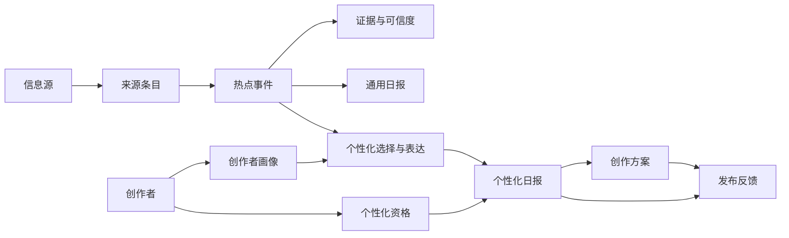

# 微蓝日报 PRD

| 属性 | 内容 |
|---|---|
| 文档版本 | v1.1 |
| 当前基线 | 2026-08-21 |
| 状态 | 邀请制 MVP 已实现并上线，进入真实数据与付费验证 |
| 目标平台 | Web；Email 为待接入送达渠道 |
| 首个内容场景 | 海外 AI 动态 → 抖音选题 |
| 配套文档 | [决策备忘](./决策备忘.md) · [领域术语](./CONTEXT.md) · [ADR-0001](./docs/adr/0001-shared-hot-event-pool-personalized-recommendations.md) |

## 1. 产品定义

### 1.1 一句话定位

每天把海外最新 AI 动态，转化成三个适合创作者账号的抖音选题。

### 1.2 用户问题

持续更新 AI 内容的抖音创作者，需要同时完成四项工作：及时发现热点、判断是否值得跟进、找到适合自己账号的差异化角度、组织成可以开始拍摄的内容。资讯产品通常只回答“发生了什么”，通用 AI 工具又要求创作者先知道该问什么，两者都没有直接回答：

> 以我的账号定位，今天最值得发布什么？

### 1.3 产品解法

微蓝日报使用固定的高质量海外信息源，完成采集、去重、事件聚类、价值排序、证据保留和可信度标注；每天形成一份完整通用日报，并基于同一共享热点事件池，为具有个性化资格的创作者生成三个个性化选题。创作者可以展开创作方案，并反馈“想做”“不感兴趣”或“已发布”。

### 1.4 产品形态

- 前台是每天一份稳定日报，不是实时雷达或无限信息流。
- 后台可以持续采集，前台只在重大事件出现时追加当日补充。
- 通用日报负责证明内容价值；个性化选择、创作方案和主动送达承担订阅价值。
- 运营者使用独立运营工作台完成内容、创作者、反馈、站点和系统运营。

## 2. 当前阶段与状态口径

### 2.1 当前阶段

公开站点、创作者链路、人工订阅和独立运营工作台已经实现并部署。当前阶段不是继续堆叠页面，而是补齐真实数据和真实交付条件，并验证创作者是否真的会依据建议发布和付费。

### 2.2 状态定义

| 状态 | 定义 |
|---|---|
| 已上线 | 页面、接口和权限已经部署，可进行线上访问和操作 |
| 已实现待真实验证 | 功能链路存在，但内容质量、真实用户行为或商业结果尚未得到验证 |
| 待接入 | 当前仍依赖占位、mock、日志或人工方式，不能宣传为正式能力 |
| 延后 | 已明确不进入当前邀请制 MVP |

### 2.3 当前能力总览

| 能力 | 状态 | 说明 |
|---|---|---|
| 公开日报、往期归档 | 已上线 | 归档排除最新一期 |
| 邀请注册、画像、个性化日报 | 已上线，待真实验证 | 无模型 Key 时使用 mock 内容 |
| 创作方案、发布反馈 | 已上线，待真实验证 | 尚未连接抖音表现数据 |
| 产品反馈 | 已上线 | 支持提交、查看和状态流转 |
| 人工订阅、邀请码 | 已上线 | 自动支付未接入 |
| 独立运营工作台 | 已上线 | 运营角色由服务端校验 |
| 真实 X 数据采集 | 待接入 | 当前 X 账号是占位来源 |
| 真实邮件发送 | 待接入 | 当前只生成模拟送达记录 |
| 自动支付 | 待接入 | 当前由运营者人工确认 |
| 收藏、搜索、多领域 | 延后 | 不属于当前 MVP |

## 3. 目标创作者与核心任务

### 3.1 核心创作者

成长型个人 AI 抖音创作者：

- 已有持续更新习惯，理想频率为每周至少三次；
- 账号规模优先集中在约 1,000–100,000 粉丝；
- 内容聚焦 AI 产品、功能更新和实际使用案例；
- 希望比中文平台更早发现海外动态；
- 缺少稳定选题流程，或每天为判断热点价值消耗大量时间。

### 3.2 核心 JTBD

> 当海外出现新的 AI 产品、功能或使用案例时，我希望快速知道它是否值得我的账号今天跟进、应该从什么角度讲，以及怎样组织成一条可以开始拍摄的抖音内容，从而持续更新而不被热点甩在后面。

### 3.3 价值层级

1. **不遗漏**：知道最近发生了什么。
2. **会判断**：知道哪些事件值得抖音创作者跟进。
3. **适合我**：知道哪个事件和角度符合自己的账号定位。
4. **能行动**：得到可以开始拍摄的钩子、结构、画面建议和风险提示。

## 4. 产品目标与非目标

### 4.1 当前目标

1. 让目标创作者每天在 5 分钟内判断一至三个值得跟进的 AI 选题。
2. 让创作者不必自行浏览大量海外来源，也能获得带证据和可信度的热点信息。
3. 将共享热点事件转化为符合创作者画像的内容角度和创作方案。
4. 让运营者能够核对通用内容、每位创作者实际收到的内容、送达状态和反馈。
5. 验证创作者是否会依据建议发布内容，并愿意为持续个性化服务付费。

### 4.2 明确非目标

- 通用网页搜索、语义问答或实时新闻雷达。
- 同时服务所有自媒体人或多个内容领域。
- 创作者自定义信息源。
- 抖音账号数据读取、自动制作或自动发布视频。
- 无限制生成完整逐字稿。
- 多档套餐、团队账户和用量计费。
- 兑换会员或邀请送会员等裂变奖励。
- 微信／飞书推送和自动支付。
- 让运营者任意编辑页面 HTML、视觉样式或商业规则。

## 5. 产品原则

1. **行动优先于信息数量**：三个可行动选题优于二十条新闻摘要。
2. **来源与发布平台分离**：海外来源负责发现，抖音内容逻辑负责表达。
3. **共享事实，个性化判断**：所有创作者共享事件、证据和可信度，个性化只改变选择与表达。
4. **日报稳定，采集持续**：后台高频采集不等于前台实时滚动。
5. **速度不牺牲透明度**：早期信号可以收录，但必须明确证据状态。
6. **创作辅助不是完整代写**：帮助创作者形成差异化内容，不批量制造同质逐字稿。
7. **发布行为比打开率更接近价值**：核心问题是创作者是否依据建议行动。
8. **运营看到真实交付结果**：运营者必须能看到创作者实际收到的个性化内容，而不只审核公共日报。

## 6. 角色与产品边界

### 6.1 访客

- 阅读当天完整通用日报。
- 阅读不包含最新一期的往期归档。
- 查看产品介绍和会员说明。
- 提交产品反馈。
- 注册或登录。

### 6.2 创作者

除访客能力外，登录创作者还可以：

- 维护一个当前创作者画像；
- 在具有个性化资格时查看个性化日报；
- 展开创作方案；
- 提交和修改发布反馈；
- 查看自己的历史个性化日报和订阅状态。

用户端当前界面仍使用“订阅日报”等已有名称，但产品领域统一称为“个性化日报”。“邮箱日报”和“我的收藏”不计入当前已交付能力；收藏属于后续能力。

### 6.3 运营者

运营者不是创作者。登录后进入独立 `/ops` 工作台，不复用普通用户导航，不计入创作者和订阅统计，也不能给自己开通订阅。

## 7. 信息架构

### 7.1 公开与创作者站点

- 公开日报；
- 往期归档；
- 个性化日报；
- 创作者画像；
- 升级会员；
- 意见反馈；
- 产品介绍；
- 登录与邀请注册。

### 7.2 运营工作台

| 分组 | 页面 |
|---|---|
| 总览 | 运营概览 |
| 内容运营 | 今日日报、候选事件、日报记录 |
| 个性化运营 | 个性化内容、邮件送达 |
| 创作者运营 | 创作者、订阅管理、邀请码 |
| 反馈 | 产品反馈、发布反馈 |
| 站点运营 | 产品介绍、会员页面 |
| 系统 | 信息源、采集状态、任务记录 |

运营侧只保留一个“查看公开站点”入口用于预览。公开日报和往期归档不作为运营模块嵌入工作台。

## 8. 核心用户旅程

### 8.1 公开阅读与转化

1. 访客通过分享链接、搜索结果或邀请进入通用日报。
2. 访客完整阅读选题建议、热点速览、证据和可信度。
3. 访客通过会员页理解通用日报与个性化日报的差异。
4. 访客使用邀请码注册。
5. 创作者填写画像并开始三份个性化日报体验。

### 8.2 创作者每日使用

1. 当天主日报和共享热点事件准备完成。
2. 具有个性化资格的创作者获得三个个性化选题。
3. 创作者选择一个选题展开创作方案。
4. 创作者标记“想做”“不感兴趣”或“已发布”。
5. 体验结束后，创作者通过人工确认订阅继续获得个性化服务。

### 8.3 运营每日工作

1. 在运营概览查看异常与待办。
2. 查看候选事件、证据和可信度，完成主日报质检与发布。
3. 核对应该获得个性化日报的创作者是否生成成功。
4. 检查个性化内容、创作方案、邮件记录和发布反馈。
5. 处理新产品反馈、即将到期订阅和系统异常。

### 8.4 白天重大更新

1. 后台持续采集并形成候选事件。
2. 满足重大更新规则的事件进入当日补充候选。
3. 通过可信度检查后追加到当天日报。
4. 既有主要选题不因普通新增信息被替换。
5. 当前 MVP 不发送第二封突发邮件。

## 9. 功能需求

优先级：P0 为当前邀请制 MVP 核心；P1 为真实验证后优先补充；P2 为明确延后。

### FR-01 固定信息源（P0）

系统维护固定的高质量海外 AI 信息源，包括 X 账号、官方博客、GitHub 仓库、产品页或更新日志。

验收标准：

- 信息源保留类型、名称、URL、启用状态、可信级别和单日条目上限。
- 信息源只能由运营者维护，创作者不能自行添加。
- 单一来源故障不阻断其他来源。
- 单一来源不能无上限占据日报。
- X 真实采集在商业验证前必须完成稳定性、成本和合规审查。

当前状态：管理和采集框架已上线；真实 X 采集待接入。

### FR-02 采集、规范化与事件聚类（P0）

系统持续采集来源条目，将重复内容和描述同一件事的多个来源合并为热点事件。

验收标准：

- 来源条目保留作者、原始 URL、发布时间、采集时间和信息源。
- 相同或规范化后相同的 URL 不重复入库。
- 热点事件保留全部证据，不因合并丢失原始链接。
- 同一热点事件不会在同一份日报中重复出现。
- 运营者能够看到采集失败、事件评分和证据数量。

当前状态：流程已上线；真实来源连续运行和聚类质量待验证。

### FR-03 排序、可信度与发布时间（P0）

系统按照 AI 抖音创作者的内容价值排序，而不是只按社交互动量排序。

排序至少考虑：新鲜度、相关性、可解释性、短视频行动性、差异度、证据充分度和中文内容饱和风险。

验收标准：

- 主要选题优先使用 24 小时内事件；不足时放宽到 48 小时。
- 仍不足三个时宁缺毋滥，不使用低可信内容凑数。
- 对外事实可回溯到证据链接。
- “官方确认”至少包含一个官方证据。
- “多方报道”至少包含两个独立证据。
- 单一非官方来源只能标记为“早期信号”。
- 发布时间建议使用未来的绝对截止时间并说明原因。

当前状态：规则和流程已实现；排序公式、真实内容质量和更正流程待评测。

### FR-04 通用日报与当日补充（P0）

系统每天形成一份稳定通用日报，目标发布时间为北京时间 08:00。

主日报包含：

- 一至三个主要选题，目标为三个；
- 五至七条热点速览；
- 日报日期、发布时间和最近采集时间；
- 证据链接和可信度标签。

每个主要选题至少包含：发生了什么、发布价值、通用切入角度、前三秒钩子、内容结构、画面建议和发布时间窗口。

当日补充只追加重大事件，不替换普通主选题，不触发第二封邮件。

当前状态：生成、质检和发布流程已上线；08:00 自动调度和真实内容连续性待验证。

### FR-05 公开日报与往期归档（P0）

验收标准：

- 无需登录即可阅读当天完整通用日报。
- 每份日报具有稳定、可分享的 URL。
- 往期归档排除最新一期，从上一期开始展示历史日报。
- 桌面端左侧选择历史日报，右侧阅读所选完整内容；移动端改为上下布局。
- 归档列表默认选择最近一期历史日报。
- 页面不使用雷达大屏或无限滚动作为主交互。

当前状态：已上线。

### FR-06 邀请注册、登录与创作者画像（P0）

验收标准：

- 注册需要有效邀请码。
- 密码规则：长度 6–128 位，只允许 ASCII 可打印非空白字符（字母、数字、常见符号），禁止空格、制表符、中文、全角空格和 emoji；输入框静默过滤非法字符，服务端兜底校验。
- 创作者可以维护一个当前画像。
- 画像包含账号定位、目标观众、人设、表达风格、视频长度和内容禁区。
- 修改画像只影响之后生成的日报，不改写历史内容。
- 不要求连接抖音账号或上传历史作品。

当前状态：已上线。

### FR-07 个性化日报（P0）

系统基于共享热点事件池和创作者画像，为具有个性化资格的创作者生成个性化日报。

验收标准：

- 每位创作者每天最多一份个性化主日报。
- 每份目标为三个个性化选题。
- 个性化不改变事件事实、证据和可信度。
- 页面说明推荐与画像的关联理由。
- 历史个性化日报只对创作者本人可见。
- 运营者可以按创作者和日期核对实际生成内容，但首版不随意改写历史结果。

当前状态：功能已上线；真实模型内容质量和多创作者差异度待验证。

### FR-08 创作方案与发布反馈（P0）

创作者可以展开个性化选题，获得核心观点、可选钩子、内容结构、画面建议、标题方向和风险提示。

验收标准：

- 创作方案不是可以直接发布的完整逐字稿。
- 每位具有资格的创作者每天最多展开当天三个选题。
- 展开按钮可以重复展开和收起。
- 生成失败允许重试，但不重复扣减权益。
- 创作者可以提交并修改“想做”“不感兴趣”“已发布”。
- “已发布”可以选填抖音作品链接。

当前状态：已上线，待真实创作者行动验证。

### FR-09 体验与订阅（P0）

商业规则：

- 三份免费个性化日报体验；
- 标准价 ¥49/月；
- 前 50 位创始订阅用户 ¥29/月；
- 连续订阅期间保留创始价格；
- 不要求体验用户预绑支付方式。

验收标准：

- 体验按成功生成且可访问的日报份数计算，不按 72 小时计算。
- 体验结束后仍可阅读通用日报。
- 运营者可以人工开通和续期订阅。
- 订阅记录保留价格类型、开始时间、到期时间和有效状态。
- 运营账号不进入订阅开通对象。

当前状态：人工流程已上线；自动支付待接入。

### FR-10 邮件送达（P0，外部能力待接入）

目标能力：主日报生成后，向体验创作者和有效订阅用户发送包含三个个性化选题和日报链接的邮件。

验收标准：

- 发送状态可追踪并允许失败重试。
- 免费访客不收到个性化邮件。
- 当日补充不触发额外邮件。
- 邮件链接进入对应创作者可访问的日报。
- 支持退订和合规发件身份。

当前状态：数据记录和运营查看已实现；当前仅模拟发送，真实邮件供应商、域名和退订待接入。

### FR-11 产品反馈（P0）

验收标准：

- 意见反馈作为站内页面提供，不使用脱离产品的弹窗。
- 支持功能问题、内容质量、使用体验、会员与付费、功能建议和其他类型。
- 反馈内容为 5–2000 字，联系邮箱选填。
- 登录创作者自动带入邮箱，访客仍可提交。
- 运营者可以按“新建／处理中／已解决”流转状态。
- 产品反馈与发布反馈在产品和运营界面中保持分离。

当前状态：已上线。

### FR-12 运营身份与会话（P0）

验收标准：

- 运营权限以服务端用户角色为唯一依据。
- 当前只保留一个运营账号。
- 运营会话与创作者会话分开保存，互不覆盖。
- 进入工作台时重新向服务端校验角色。
- 所有运营接口执行服务端权限校验。
- 旧 `/review` 地址兼容跳转到运营工作台，不继续承担独立产品导航。

当前状态：已上线。

### FR-13 运营概览与内容运营（P0）

运营概览优先展示异常和待办，包括日报状态、个性化生成缺口、邮件失败、新反馈和资格异常。

内容运营支持：

- 查看候选事件、证据、可信度和评分；
- 通过、拒绝、替换和修正文案；
- 发布今日日报；
- 查看草稿与发布历史。

“日报记录”是运营生成和发布历史，不等同于用户侧“往期归档”。

当前状态：已上线。

### FR-14 个性化、创作者与反馈运营（P0）

验收标准：

- 按创作者和日期查看个性化日报、推荐理由、证据和创作方案。
- 查看发布反馈及抖音作品链接。
- 查看创作者画像、资格、试用余量、订阅、日报数量和最近内容互动。
- 不把“最近生成或反馈”误称为“最近登录”或“打开率”。
- 查看和处理产品反馈。
- 查看订阅记录并人工开通订阅。
- 查看和生成邀请码。

当前状态：已上线。

### FR-15 站点与系统运营（P0）

站点运营验收标准：

- 产品介绍和会员页采用结构化字段。
- 支持草稿、预览、发布和回滚。
- 公开页面只读取已发布版本。
- 不允许通过内容编辑器修改 HTML、页面布局、颜色、跳转地址、会员价格或订阅规则。
- 不复制第三方产品的完整文案、图片和页面内容。

系统运营验收标准：

- 查看和启停信息源。
- 查看最近采集、失败原因和累计条目。
- 查看后台任务状态和错误。
- 监控页默认只读，不在没有人工确认时触发高风险外部操作。

当前状态：已上线。

### FR-16 行为分析与偏好学习（P1）

- 记录日报打开、创作方案展开、发布反馈、付费和续订漏斗。
- 使用“想做”“不感兴趣”“已发布”调整之后的选题优先级。
- 调整只影响选择和表达，不改变事件事实。
- 创作者可以清除由反馈形成的偏好。

当前状态：发布反馈数据已存在；打开率、完整漏斗和自动偏好学习尚未实现。

### FR-17 延后能力（P2）

- 我的收藏。
- 关键词搜索、语义搜索和历史问答。
- 创作者自定义信息源。
- 多画像、团队账户和多档套餐。
- 导入历史作品进行风格分析。
- 连接抖音并读取表现数据。
- 微信／飞书推送。
- 自动支付和用量计费。
- 自动制作或发布视频。
- 舞蹈及其他领域的信息源池。

## 10. 页面需求

### 10.1 公开日报

从上至下展示日期和时间、今日摘要、一至三个完整选题、热点速览、当日补充（如有）、个性化价值入口和往期归档入口。

### 10.2 往期归档

- 最新一期不进入归档。
- 左侧显示历史日报列表，默认选择最近一期历史日报。
- 右侧显示所选日报完整内容。
- 支持较新和更早切换。
- 移动端改为上下布局。

### 10.3 个性化日报

- 日期、画像摘要和推荐理由。
- 三个个性化选题。
- 展开／收起创作方案。
- “想做／不感兴趣／已发布”反馈。
- 历史个性化日报入口。

### 10.4 创作者画像

- 六项画像字段。
- 保存和修改提示。
- 明确修改只影响之后的日报。
- 不展示信息源配置。

### 10.5 升级会员

- 展示三份免费体验。
- 展示创始价、标准价和连续订阅规则。
- 展示免费与订阅权益对比。
- 登录订阅用户可看到当前价格类型和到期时间。
- 明确当前为人工确认付款，不展示不可用的自动支付按钮。

### 10.6 意见反馈

- 反馈类型、内容、选填联系邮箱。
- 字数、必填和错误提示。
- 提交成功状态和反馈编号。
- 提醒不要提交密码、密钥等敏感信息。

### 10.7 产品介绍

- 使用微蓝日报自己的品牌、文案和素材。
- 说明“不遗漏、会判断、能行动”三层价值。
- 提供公开日报和会员页入口。
- 读取运营者已发布的结构化文案。

### 10.8 运营工作台

- 使用独立布局、详细侧栏和独立 URL。
- 总览先显示异常与待办，再进入业务页面。
- 每个页面有加载、空数据和错误重试状态。
- 支持桌面端和移动端使用，不出现横向溢出。
- 可在新标签打开公开站点，不复用公开站点导航。

## 11. 核心数据关系

关键约束：

- 一个热点事件至少有一个证据，可以关联多个来源条目。
- 通用日报和个性化日报引用同一热点事件，不产生互相冲突的事实副本。
- 一个创作者每天最多一份个性化主日报。
- 创作方案属于一个个性化选题。
- 发布反馈属于“创作者 + 选题建议”的组合。
- 产品反馈不属于选题建议，与发布反馈分开管理。

## 12. 商业模式

### 12.1 免费层

- 当天完整通用日报。
- 不包含最新一期的公开往期归档。
- 产品介绍和意见反馈。
- 不提供持续个性化选题、创作方案和邮件送达。

### 12.2 免费体验

- 使用邀请码注册。
- 获得三份成功生成且可访问的个性化日报。
- 不预先绑定支付方式。
- 体验结束后保留公开内容访问。

### 12.3 个人订阅

- ¥49/月标准价。
- 前 50 位创始订阅用户 ¥29/月。
- 一个创作者画像。
- 每日三个个性化选题。
- 当日选题对应的创作方案。
- 历史个性化日报。
- 真实邮件送达在接入后提供。
- 收藏为 P1，不属于当前权益。

## 13. 指标与验证计划

### 13.1 北极星行为

每周依据微蓝日报选题建议发布至少一条抖音内容的活跃创作者数量。

### 13.2 产品漏斗

1. 访问通用日报。
2. 使用邀请码注册。
3. 完成创作者画像。
4. 获得并打开个性化日报。
5. 展开至少一个创作方案。
6. 标记“想做”。
7. 标记“已发布”并可提交作品链接。
8. 体验结束后付费。
9. 次月续订。

当前限制：系统已有生成、方案和发布反馈数据，但尚不能准确判断最近登录、日报打开率和邮件打开率；在行为采集完成前，运营界面只能使用“最近内容互动”等可证实指标。

### 13.3 首轮 14 天信号

以约 8 位定向邀请为基准：

- 5 位完成画像；
- 3 位连续使用三份体验；
- 2 位依据建议发布内容；
- 至少 1 位真实付费。

这些结果只代表出现初步信号，不代表产品市场匹配。

### 13.4 扩张门槛

同时满足以下条件前，不扩展到其他领域：

- AI 抖音方向至少 20 位持续付费创作者；
- 真实数据采集、质检和发布流程稳定；
- 单一来源失衡和内容更正有可重复的控制方法；
- 发布反馈能够持续改善个性化推荐。

## 14. 非功能需求

### 14.1 可追溯性

- 对外事实关联可访问证据。
- 记录采集、聚类、评分、生成和人工修改的时间与版本。
- 历史日报在规则变更后保持原样；更正通过显式状态追加。

### 14.2 权限与隐私

- 创作者只能访问自己的画像、个性化日报、创作方案和反馈。
- 公开日报不得泄露创作者画像。
- 运营接口必须由服务端校验运营角色。
- 运营会话与普通创作者会话互不覆盖。
- 只采集完成产品功能所需的最少个人信息。

### 14.3 内容与输入安全

- 外部来源正文视为不可信输入，不允许其中的指令改变系统提示或权限。
- 创作者输入不能改变事实、证据和权限规则。
- 输入 URL 需要检查协议、域名和内网地址，防止 SSRF。
- 页面不展示抓取凭据、Cookie、账号密码或模型密钥。

### 14.4 成本控制

- 共享事件分析和通用日报结果不为每位创作者重复计算。
- 每位具有资格的创作者每天批量生成一次个性化日报。
- 每位创作者每天最多展开当天三个创作方案。
- 模型调用保留超时、重试和成本上限。

### 14.5 来源合规

- 优先使用官方 API、公开 Feed 或符合来源条款的服务。
- 展示摘要和必要证据，链接回原始来源，不复制完整受保护内容。
- X 商业采集和第三方设计素材在使用前分别完成条款与版权审查。

## 15. 边界与异常场景

- **单一来源大量发文**：聚类后限制进入日报的数量，不能主导三个主要选题。
- **同一事件跨日发展**：只有出现重大能力变化、正式发布或官方更正时才形成新阶段。
- **不足三个合格选题**：如实发布一至两个，不用低可信或过期内容补齐。
- **早期信号被否认**：保留原日报，在顶部增加更正状态和新证据，不静默删除。
- **创作者修改画像**：已生成日报保持不变，新画像从下一份日报生效。
- **来源或模型故障**：显示最近成功时间，不把陈旧或 mock 内容包装成真实最新内容。
- **多位创作者得到相似事件**：共享事件属于预期行为，个性化理由、角度和结构应体现画像差异；不承诺选题独占。
- **邮件失败**：不影响日报本身的网页访问，运营者可以看到失败并在真实邮件接入后重试。
- **运营登录被普通账号覆盖**：工作台以独立会话和服务端角色校验阻止错配访问。

## 16. 商业验证前检查清单

### 已具备

- [x] 公开日报、往期归档和稳定页面 URL。
- [x] 邀请注册、创作者画像和个性化日报页面。
- [x] 创作方案和三种发布反馈。
- [x] 产品反馈提交与运营处理。
- [x] 人工订阅、邀请码和订阅状态。
- [x] 独立运营工作台及服务端角色校验。
- [x] 产品介绍和会员页的草稿、发布与回滚。

### 仍需完成

- [ ] 真实 X 数据方案和至少 30 个有效来源完成审查。
- [ ] 真实模型连续生成至少三份可用日报并通过人工评测。
- [ ] 真实邮件供应商、发件域名、退订和失败重试。
- [ ] 自动或可靠的 08:00 日报调度完成线上演练。
- [ ] 首批 5–9 位目标创作者完成三份体验。
- [ ] 至少一笔真实付费和一次续订流程得到验证。
- [ ] 日报打开、方案展开、发布和付费漏斗能够准确采集。
- [ ] 用户协议、隐私政策、内容更正和来源下架流程完成。

## 17. 开放项

1. X 数据获取的长期供应商、成本上限和合规方案。
2. 真实邮件供应商和送达质量目标。
3. 自动支付、退款、续费和发票规则。
4. 排序公式、重大当日补充阈值和内容质量评测集。
5. 行为分析事件定义与隐私告知。
6. 品牌正式域名、用户协议和隐私政策。
