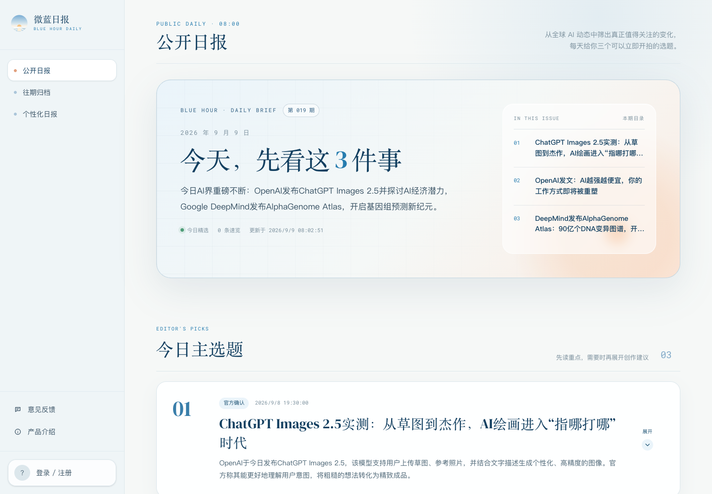

# Blue Hour Daily

**English** | [简体中文](README.zh-CN.md)

<p align="center">
  
</p>

Actual public-site screenshot captured on September 9, 2026. It shows that day's page state; briefing content changes over time.

**Turn the latest global AI developments into three video topics tailored to a creator's account.**

Blue Hour Daily helps individual AI-content creators on Douyin move from scattered news to a usable short-video plan: what happened, why it matters, which angle fits their audience, and how to start filming.

The invitation-based MVP includes deployed pages, APIs, creator journeys and an operations workspace. Real-source coverage, model-generated content quality, email delivery and willingness to pay still require validation. A working feature is not the same as a validated business.

**[Open the product](https://sbi34p3pcick3cph3km5b.apigateway-cn-beijing.volceapi.com/)**

## Product approach

The main experience is a stable daily briefing, not a real-time news feed. Creators share the same event pool, evidence and confidence information. Personalization changes topic selection, value judgments, creative angles and production plans, rather than rewriting the underlying facts for each person.

## For visitors and creators

- **Public daily briefing:** general topics, a news overview, evidence and confidence information.
- **Archive:** browse previous issues, excluding the latest one, with an issue list beside the reading area.
- **Personalized daily:** three topics per eligible creator, based on their profile.
- **Production plans:** opening hooks, story structure, visual suggestions, headline directions and risk notes.
- **Creator profile:** positioning, target audience, delivery style, video length and subjects to avoid.
- **Membership:** trial allowance, benefits, founding-member pricing and subscription status.
- **Feedback:** product issues and suggestions from visitors or creators.
- **Product introduction:** positioning and core value.

## For operators

Operators use a separate `/ops` workspace with its own navigation and access controls:

- Overview, today's briefing, candidate events and issue history.
- Personalized content and email-delivery records.
- Creators, subscriptions and invitation codes.
- Product feedback and publishing feedback.
- Draft, publish and rollback controls for introduction and membership pages.
- Sources, collection status and task records.

Operator and creator sessions are separated. Operator access is checked on the server; an ordinary creator account cannot use the operations workspace.

## MVP subscription rules

- Each registered creator receives three free personalized briefings, counted only after successful generation and availability.
- The configured standard price is **¥49/month**.
- The first 50 founding subscribers receive **¥29/month** while their subscription remains continuous.
- Operators currently confirm payment and activate subscriptions manually; automatic payment is not connected.
- Creators can continue reading the public daily after their trial ends, but cannot receive new personalized briefings without eligibility.

## Capability status

| Capability | Status | Qualification |
|---|---|---|
| Public daily, archive and sharing | Deployed | Available through the frontend |
| Invitation signup, profile and personalized daily | Deployed; real-content validation pending | Mock results are used when no model key is configured |
| Production plans and publishing feedback | Deployed; user validation pending | No Douyin analytics readback integration |
| Product feedback workflow | Deployed | Submission and operator status handling |
| Manual subscriptions and invitation codes | Deployed | No automatic payment integration |
| Separate operations workspace | Deployed | Server-side role checks and separated sessions |
| Real X collection | Pending | Placeholder X accounts do not establish a commercial data capability |
| Real email sending | Pending | Current delivery records are simulated; no real email is sent |
| Automatic payment | Pending | Activation is manual |
| Favorites, search and multiple content domains | Deferred | Outside the current invitation-based MVP |

These are the documented implementation boundaries, not a claim that every external integration has been validated in production.

## Live endpoints

- [Product](https://sbi34p3pcick3cph3km5b.apigateway-cn-beijing.volceapi.com/)
- [Operations workspace](https://sbi34p3pcick3cph3km5b.apigateway-cn-beijing.volceapi.com/ops)
- [Backend API](https://sc0hshvaar6kuul9kb1pu.apigateway-cn-beijing.volceapi.com/)

The operations workspace requires an operator account. Test accounts and passwords are not published in repository documentation.

## Repository structure

```text
├── PRD.md                  # Product requirements
├── 决策备忘.md             # Product decisions
├── CONTEXT.md              # Domain vocabulary
├── docs/                   # Architecture, deployment and implementation notes
├── backend/                # FastAPI, data models, collection, generation and operator APIs
└── frontend/               # Next.js public site, creator pages and operations workspace
```

## Local development and checks

Start with the technical documents for environment setup and deployment. On the configured local development machine, the repository also provides `一键启动微蓝日报.command`.

Common checks:

```bash
# Backend, from the repository root
cd backend
./.venv/bin/python -m pytest -q
```

```bash
# Frontend, from the repository root
cd frontend
npm run lint
npx tsc --noEmit
npm run build
```

The existing project documentation records a baseline of 84 backend tests plus frontend lint, TypeScript and production-build checks. See the implementation documents for the context of those results.

## Documentation

Detailed product and engineering documents are currently in Chinese.

- [Product requirements](PRD.md)
- [Product decisions](决策备忘.md)
- [Domain vocabulary](CONTEXT.md)
- [ADR-0001: Shared events and recommendation-layer personalization](docs/adr/0001-shared-hot-event-pool-personalized-recommendations.md)
- [Operations workspace deployment](docs/运营工作台-上线说明.md)
- [Technical adaptation statement](docs/技术适配声明.md)

## Next validation steps

1. Connect and review a real X-data acquisition approach.
2. Generate consecutive issues from real sources and model responses, then assess content quality.
3. Connect an email provider, sender domain, unsubscribe handling and delivery retries.
4. Validate the three-issue trial, manual payment and next-month renewal flow.
5. Complete measurements for issue opens, plan expansion, publishing and payment conversion.
6. Complete user terms, privacy policy and content-correction procedures.
